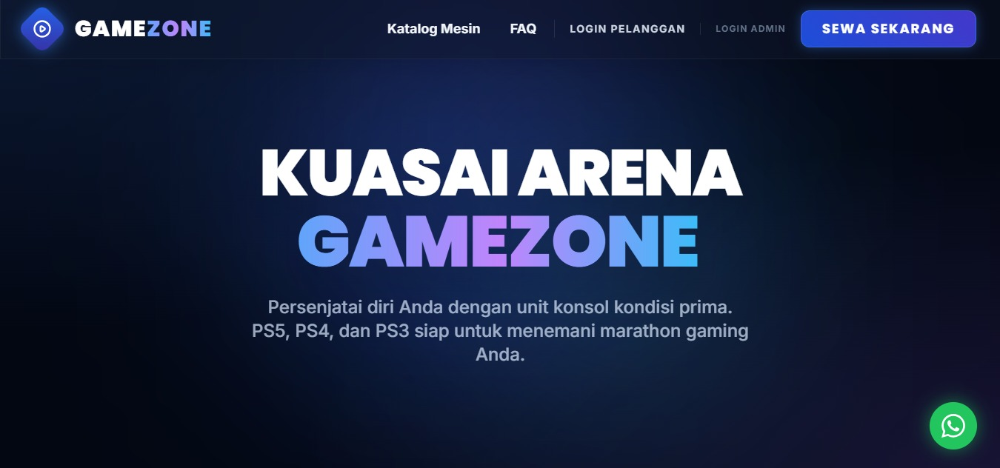
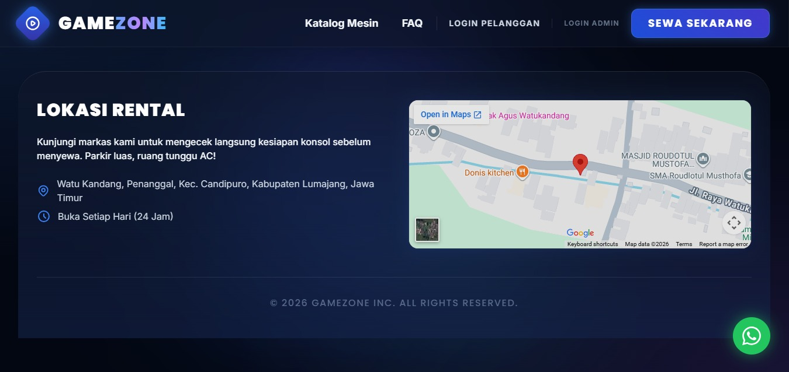
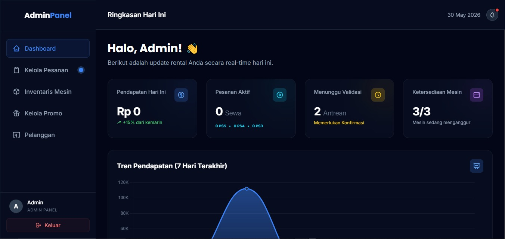

# Dokumentasi Penggunaan Sistem: GAMEZONE

## 1. Gambaran Umum Sistem

**Nama Sistem:** GAMEZONE - Aplikasi Web Booking Rental PlayStation
**Tujuan dan Manfaat Sistem:** Memudahkan pelanggan dalam melakukan pemesanan (booking) jadwal sewa PlayStation (PS3, PS4, PS5) secara daring dan real-time. Manfaat lainnya adalah membantu admin atau pengelola rental dalam memanajemen pelanggan, inventaris mesin PS, serta pencatatan histori transaksi secara otomatis dan efisien.
**Target Pengguna:** 
- **Pelanggan:** Gamers atau masyarakat umum yang ingin menyewa PS.
- **Admin/Pengelola:** Pemilik atau staf tempat rental PlayStation.

**Fitur-fitur yang tersedia:**
- 🔐 Sistem Autentikasi & Multi-role (Admin dan Pelanggan)
- 📊 Dashboard Admin (Pengelolaan pelanggan & inventaris PS)
- 📅 Sistem Booking Jadwal Real-time
- 💰 Riwayat Transaksi & Kalkulasi Harga Otomatis
- 💬 WhatsApp Integration (Tombol chat langsung admin)

---

## 2. Panduan Penggunaan Fitur Sistem (User Guide)

Berikut adalah panduan tahapan penggunaan fitur pada aplikasi GAMEZONE:

### A. Autentikasi (Registrasi dan Login)
1. Akses alamat web GAMEZONE.
2. Pada halaman awal, pilih **Login**. Jika belum memiliki akun, klik **Daftar/Register**.
3. Masukkan data diri yang diperlukan. Sistem akan otomatis memisahkan tampilan hak akses antara Admin dan Pelanggan setelah login berhasil.

### B. Halaman Utama (Pelanggan)
Setelah pelanggan berhasil login, akan muncul Halaman Utama (Home).
Pada halaman ini, pelanggan dapat melihat katalog jenis PS yang disewakan, melihat status ketersediaan, serta informasi lokasi tempat rental.

### C. Sistem Booking Jadwal (Pelanggan)
1. Dari katalog di halaman utama, pilih jenis mesin PS (PS3, PS4, atau PS5) yang ingin disewa.
2. Tentukan tanggal dan waktu mulai hingga waktu selesai (durasi sewa).
3. Sistem akan memvalidasi jadwal secara real-time. Jika mesin tersedia, harga total akan dikalkulasi secara otomatis.
4. Klik tombol "Booking" atau "Pesan". Jika pelanggan butuh bantuan, dapat menekan fitur **WhatsApp Integration** untuk chat dengan admin.

### D. Dashboard Manajemen (Admin)
Admin bertugas mengelola data operasional aplikasi melalui antarmuka khusus.
1. Login menggunakan akun dengan hak akses **Admin**.
2. Masuk ke halaman **Dashboard Admin**.
3. Dari Dashboard, admin dapat melakukan hal berikut:
   - **Manajemen Inventaris:** Menambah, mengubah, atau menghapus mesin PS.
   - **Manajemen Pengguna:** Melihat data pelanggan terdaftar.
   - **Riwayat Transaksi:** Memantau semua transaksi masuk, melihat status booking, dan memverifikasi pesanan.

---

## 3. Tim Pengembang Proyek

Proyek aplikasi web GAMEZONE ini dikembangkan oleh **Kelompok 4**, dengan susunan tim sebagai berikut:

| Nama Anggota | Peran / Fokus Pekerjaan |
| :--- | :--- |
| **Ruli** | Project Manager & System Analyst |
| **Hafidhin Adinata** | UI/UX Designer & Frontend Developer |
| **M. Risal** | Database Administrator (DBA) & ERD Designer |
| **Geraldhino** | Backend Developer & API Integrator |
